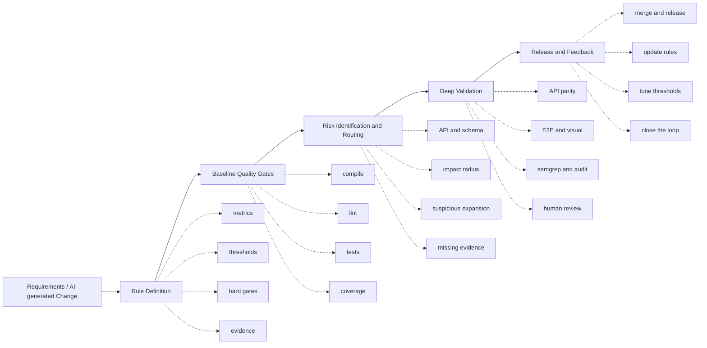

# Entrix

**Guardrails Embedded in the Change Lifecycle**

Entrix is a Harness Engineering tool for turning quality rules, architecture
constraints, and validation steps into executable guardrails.

Instead of relying on manual review at the end of delivery, Entrix moves
validation forward: checks become codified, evidence becomes traceable, and
quality gates become part of the engineering system itself.

It is designed for teams building in the AI era, where code can be generated
faster than it can be governed.

Entrix helps teams answer three questions continuously:

- should this change pass baseline quality gates?
- what level of confidence do we have in the current change?
- when should the system route the change to deeper validation or human review?

## Lifecycle View



The further to the right, the higher the fix cost, the lower the certainty of
automation, and the more human judgment is required.

Possible outcomes:

- `PASS`: continue to review, merge, and release
- `WARN`: strengthen evidence or escalate review depth
- `BLOCK`: do not merge

System foundation:

```text
docs/fitness  ->  entrix orchestration  ->  hard gates + weighted score + review triggers
```

Feedback loop:

```text
production issue / missed detection
    -> update docs/fitness
    -> refine thresholds
    -> add stronger verification templates
```

## What It Does

Today the package provides:

- architecture fitness checks grouped by dimension
- fast / normal / deep execution tiers
- change-aware execution against the current git diff
- hard-gate and weighted-score orchestration
- `review-trigger` rules that ask for human review on risky changes

It is useful both as:

- a repository-local fitness runner for monorepos and application repos
- the beginning of a more reusable fitness engine

## Installation

### Install from PyPI with `uv`

```bash
uv tool install entrix
```

Run without installing globally:

```bash
uvx entrix --help
uvx entrix run --tier fast
uvx entrix review-trigger --base HEAD~1
```

### Install from PyPI with `pip`

```bash
pip install entrix
```

### Run in a project without global install

```bash
uvx --from entrix entrix --help
uvx --from entrix entrix run --tier fast
```

### Develop the package itself from source

If you are working on the `entrix` package source itself, clone this repository and install it from the repository root.

From the repository root:

```bash
git clone https://github.com/phodal/entrix.git
cd entrix
uv pip install -e .
```

With `pip`:

```bash
git clone https://github.com/phodal/entrix.git
cd entrix
pip install -e .
```

## Quick Start

### 1. Create a fitness spec

By default, `entrix run` looks for specs under the current project's:

```text
docs/fitness/*.md
```

Example `docs/fitness/code-quality.md`:

```yaml
---
dimension: code_quality
weight: 20
threshold:
  pass: 90
  warn: 80
metrics:
  - name: lint
    command: npm run lint 2>&1
    hard_gate: true
    tier: fast
    description: ESLint must pass

  - name: unit_tests
    command: npm run test:run 2>&1
    pattern: "Tests\\s+\\d+\\s+passed"
    hard_gate: true
    tier: normal
    description: unit tests must pass
---

# Code Quality

Narrative evidence, rules, and ownership notes can live below the frontmatter.
```

### 2. Run the checks

```bash
entrix run --tier fast
entrix run --tier normal
entrix run --tier normal --scope ci --dimension code_quality --dimension testability
entrix run --changed-only --base HEAD~1
entrix validate
```

### 3. Add review triggers

By default, `review-trigger` loads the current project's:

```text
docs/fitness/review-triggers.yaml
```

Example `docs/fitness/review-triggers.yaml`:

```yaml
review_triggers:
  - name: high_risk_directory_change
    type: changed_paths
    paths:
      - src/core/acp/**
      - src/core/orchestration/**
      - services/api/**
    severity: high
    action: require_human_review

  - name: oversized_change
    type: diff_size
    max_files: 12
    max_added_lines: 600
    max_deleted_lines: 400
    severity: medium
    action: require_human_review
```

Run it:

```bash
entrix review-trigger --base HEAD~1
entrix review-trigger --base HEAD~1 --json
```

Example output:

```json
{
  "human_review_required": true,
  "base": "HEAD~1",
  "changed_files": [
    "services/api/src/routes/acp_routes.rs"
  ],
  "diff_stats": {
    "file_count": 13,
    "added_lines": 936,
    "deleted_lines": 20
  },
  "triggers": [
    {
      "name": "high_risk_directory_change",
      "severity": "high",
      "action": "require_human_review",
      "reasons": [
        "changed path: services/api/src/routes/acp_routes.rs"
      ]
    }
  ]
}
```

## Commands

### `entrix run`

Runs dimension-based fitness checks loaded from `docs/fitness/*.md`.

Common flags:

```bash
entrix run --tier fast
entrix run --parallel
entrix run --dry-run
entrix run --verbose
entrix run --changed-only --base HEAD~1
```

### `entrix validate`

Checks that dimension weights sum to `100%`.

```bash
entrix validate
```

### `entrix review-trigger`

Evaluates governance-oriented trigger rules for risky changes.

Common flags:

```bash
entrix review-trigger --base HEAD~1
entrix review-trigger --json
entrix review-trigger --fail-on-trigger
entrix review-trigger --config docs/fitness/review-triggers.yaml
```

### `entrix graph ...`

Graph-backed commands support impact analysis, test radius, and AI-friendly review context.

Examples:

```bash
entrix graph impact --base HEAD~1
entrix graph test-radius --base HEAD~1
entrix graph review-context --base HEAD~1 --json
```

## AI-Friendly Authoring Notes

If an AI agent is generating or updating fitness specs, these conventions work best:

- keep one dimension per file
- make the frontmatter executable and the body explanatory
- prefer stable command outputs over fragile text matching
- use `hard_gate: true` only when failure should really block progress
- keep review-trigger rules separate from scoring metrics
- treat markdown as the narrative layer, not the only source of structure

Recommended file layout:

```text
your-project/
  docs/
    fitness/
      README.md
      code-quality.md
      security.md
      review-triggers.yaml
```

Minimal bootstrap flow for a new repository:

```bash
mkdir -p docs/fitness
cat > docs/fitness/code-quality.md <<'EOF'
---
dimension: code_quality
weight: 100
threshold:
  pass: 100
  warn: 80
metrics:
  - name: lint
    command: npm run lint 2>&1
    hard_gate: true
    tier: fast
---

# Code Quality
EOF

entrix validate
entrix run --tier fast
```

## Python API

### Review trigger example

```python
from pathlib import Path

from entrix.review_trigger import (
    collect_changed_files,
    collect_diff_stats,
    evaluate_review_triggers,
    load_review_triggers,
)

repo_root = Path(".").resolve()
rules = load_review_triggers(repo_root / "docs" / "fitness" / "review-triggers.yaml")
changed_files = collect_changed_files(repo_root, "HEAD~1")
diff_stats = collect_diff_stats(repo_root, "HEAD~1")
report = evaluate_review_triggers(rules, changed_files, diff_stats, base="HEAD~1")
print(report.to_dict())
```

### Fitness spec loading example

```python
from pathlib import Path

from entrix.evidence import load_dimensions

dimensions = load_dimensions(Path("docs/fitness"))
for dimension in dimensions:
    print(dimension.name, len(dimension.metrics))
```

## Recommended Hook Integration

For local repositories, a practical pattern is:

- `pre-commit`: run quick lint only
- `pre-push`: run full checks, then print review-trigger warnings
- CI: run `entrix run` and publish JSON/report output

That lets automation catch deterministic failures early while still escalating ambiguous risky changes to humans.

## Known Constraints

Current constraints to be aware of:

- the package name on PyPI is `entrix`
- the default authoring format is still markdown frontmatter under `docs/fitness`
- the project is evolving toward a cleaner core / adapter / preset split
- graph commands require the optional graph dependency set

## Status

Current status:

- stable for production use in real repository workflows
- installable as a standalone PyPI package
- suitable for AI-assisted project configuration
- evolving toward a reusable fitness engine architecture
